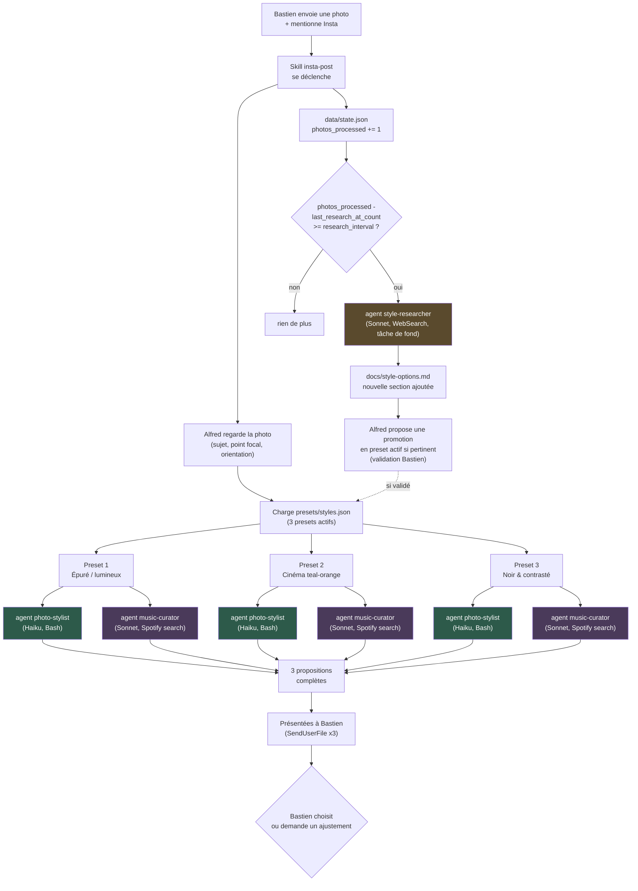

# Insta — assistant de retouche et post Instagram

Transforme une photo brute envoyée par Bastien en **trois propositions
complètes** pour Instagram (cadrage + retouche couleur + suggestion
musicale ancrée dans ses vrais goûts Spotify), et enrichit son propre
catalogue de techniques par recherche web périodique.

Se déclenche dans Claude Code quand Bastien envoie une photo en mentionnant
Insta/Instagram (skill `insta-post`) — voir `CLAUDE.md` pour le guide de
démarrage détaillé.

## Architecture



Détail complet du raisonnement architecture (pourquoi cette découpe
agents/skill, données persistées vs volatiles, historique de conception) :
[`docs/ARCHITECTURE.md`](docs/ARCHITECTURE.md).

## Composants

| Composant | Type | Modèle | Rôle |
|---|---|---|---|
| [`insta-post`](.claude/skills/insta-post/SKILL.md) | Skill | — (orchestre dans la conversation principale) | Point d'entrée. Regarde la photo, choisit le point focal, lance les agents en parallèle, présente le résultat. |
| [`photo-stylist`](.claude/agents/photo-stylist.md) | Agent | Haiku | Exécute `scripts/retouch.py` pour un preset donné — mécanique, déterministe. |
| [`music-curator`](.claude/agents/music-curator.md) | Agent | Sonnet | Cherche des morceaux Spotify ancrés dans les goûts réels de Bastien (pas un mood générique) et adaptés au style de la photo. |
| [`style-researcher`](.claude/agents/style-researcher.md) | Agent | Sonnet | Recherche web périodique (tous les 10 photos) de nouvelles techniques, documentées dans `docs/style-options.md`. |

## Structure du repo

```
CLAUDE.md                    guide de démarrage pour une session Claude Code
docs/
  ARCHITECTURE.md            raisonnement complet de l'architecture
  style-options.md           catalogue vivant de toutes les techniques connues
  research/                  recherches web archivées (source des presets)
presets/styles.json          les 3 presets actifs (crop + couleur + mood musical)
scripts/retouch.py           script de retouche paramétré par preset
data/state.json              compteur de photos / cadence de recherche
.claude/skills/insta-post/   la skill qui orchestre tout
.claude/agents/              les 3 agents ci-dessus
```

## Principes clés

- **Les photos ne sont jamais commitées** — sources et exports sont
  volatiles, envoyés directement à Bastien.
- **`docs/style-options.md` ne s'écrase jamais**, il se complète au fil des
  recherches périodiques.
- **Promouvoir une technique en preset actif reste toujours une décision
  explicite** — jamais automatique.
- **Instagram lui-même n'est pas accessible** depuis les sessions Claude
  Code (domaines Meta bloqués) — ce repo prépare les fichiers, poster reste
  manuel.

Détail complet : [`CLAUDE.md`](CLAUDE.md).
