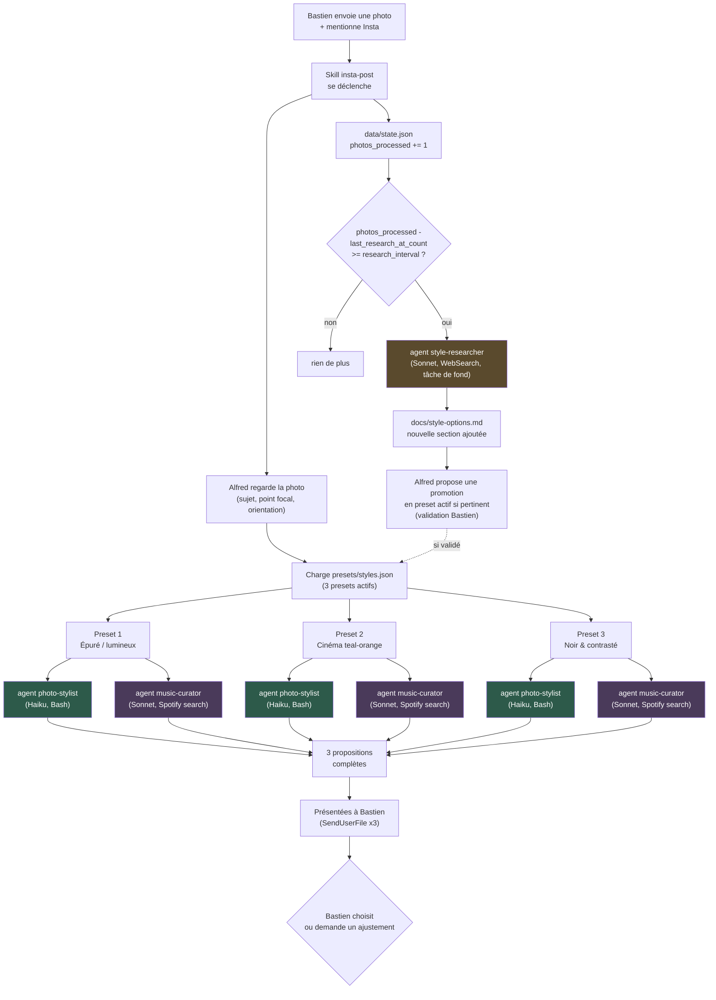

# Architecture — `insta-post`

## Vue d'ensemble

## Composants

| Composant | Type | Modèle | Rôle |
|---|---|---|---|
| `insta-post` | Skill | — (orchestre dans la conversation principale) | Point d'entrée. Regarde la photo, choisit le point focal, lance les agents en parallèle, présente le résultat. |
| `photo-stylist` | Agent | Haiku | Exécute `scripts/retouch.py` pour un preset donné. Mécanique, déterministe, aucun jugement créatif. |
| `music-curator` | Agent | Sonnet | Cherche 1-2 morceaux Spotify adaptés au mood du preset + au contenu réel de la photo. Demande un peu de jugement (fit), reste sur Sonnet. |
| `style-researcher` | Agent | Sonnet | Recherche web périodique (tous les 10 photos) de nouvelles techniques, documentées dans `docs/style-options.md`. Ne touche jamais aux presets actifs. |

## Pourquoi cette découpe (agents vs skill)

- **Ce qui reste dans la skill (conversation principale)** : tout ce qui a
  besoin de *voir* la photo (choix du point focal, appréciation de la
  composition) — un sous-agent lancé via `Task`/`Agent` ne reçoit pas
  forcément l'image de la conversation, donc ce jugement visuel reste dans
  la session qui a effectivement reçu la photo de Bastien.
- **Ce qui part en agent Haiku (`photo-stylist`)** : une fois le preset et
  le point focal fixés, l'exécution est 100% déterministe (même script,
  mêmes paramètres → même résultat) — la politique de choix de modèle
  d'Alfred réserve ce type de tâche à Haiku.
- **Ce qui part en agent Sonnet (`music-curator`, `style-researcher`)** :
  les deux demandent un vrai jugement (est-ce que CE morceau va avec CETTE
  photo ; est-ce que CETTE technique trouvée en ligne est pertinente et
  différente de ce qui est déjà catalogué) — pas mécanique, donc pas Haiku,
  mais pas non plus un besoin de raisonnement assez difficile pour justifier
  Opus.
- **Parallélisation** : les 3 presets sont indépendants — `photo-stylist`
  et `music-curator` sont lancés 3x chacun en parallèle plutôt qu'en
  séquence, pour que les 3 propositions arrivent en même temps plutôt que
  d'attendre 6 exécutions à la suite.

## Données persistées vs volatiles

- **Persisté (commité)** : `presets/styles.json` (presets actifs),
  `docs/style-options.md` (catalogue complet), `data/state.json` (compteur
  de photos / cadence de recherche), `docs/research/*` (recherches web
  complètes archivées).
- **Volatile (jamais commité)** : les photos sources et les images
  retouchées produites — envoyées directement à Bastien
  (`SendUserFile`), jamais stockées dans le repo (ce sont des photos
  personnelles, pas de la documentation de projet).

## Historique de conception

Conçu le 2026-09-05 après une première itération manuelle (un seul script
`retouch.py` non paramétré, un seul style, testé sur une photo — voir
`docs/research/photo-retouching-methods.md` pour le diagnostic qui a motivé
le passage à plusieurs styles distincts plutôt qu'un réglage global unique).
Bastien a demandé explicitement : trois propositions par photo (cadrage +
retouche + musique), une recherche web périodique pour enrichir le
catalogue de techniques (tous les 10 photos), et une architecture
documentée avec agents/skills — ce document répond à cette dernière
demande.
